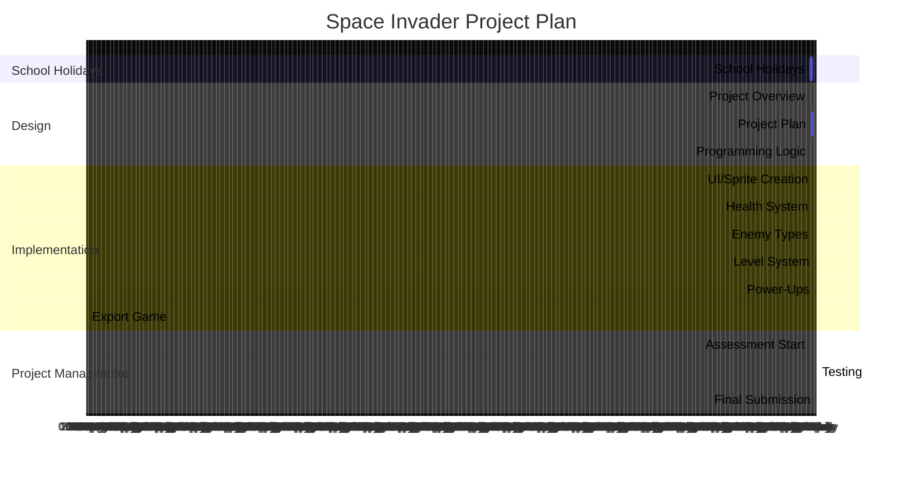

# Project Overview
This game is a spin off of the game "Space Invaders". This games theme is "children drawings".

The player will be face with a large nose and big lips with the eyes spread far.

## New Gameplay

### Player Power-ups
Power-ups have a chance to fall from defeated enemies. Only power-up can be on screen at once. There are a total of 5 different power-ups. Multishot; Increases amount of bullets fired by 2, these bullets shot diagonally forward to the left and right, Multishot lasts for 5 shots. Haste; Increases movement by set% for a set duration. Lazer; Converts normal fire to a Lazer that pierces enemies. Lazer is a one-time use. Shield; Creates a shield above the player blocking incoming projectile, lasts for a set amount of time. Freeze; Temporarily stops enemy movement and firing for a short duration. Power-ups activate on command.

### Enemy Types
There are 3 different enemy types. Mini; Smaller than the average enemy, but fast movement, no fire, unique pathing. Average; Base speed, size and can fire. Giant; Larger than average enemy, no movement,triple fire ang gaurenteed power-up drop.

### Level System
When all enemies are defeated, the level moves on. Each level will increase in difficulty, more enemies, faster speed, different enemy types introduced.

# Behaviour - User Journey

# Planning Diagram - Project Plan
